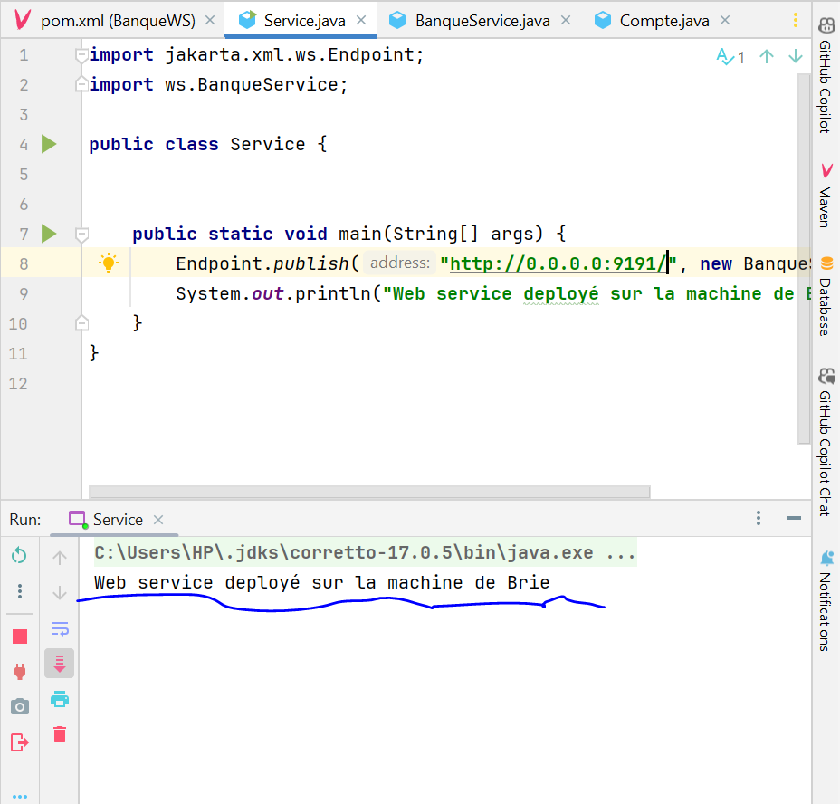

# BankWebService

# MAWUVIWO Yawa Brinda

Cette repository Git abrite un Web service qui permet de convertir l'euro en DH, de consulter des comptes individuels et
d'accéder à des listes de comptes. Déployé sur un serveur JAX-WS, le service a été testé avec l'outil SoapUI et un
client SOAP en Java a été créé.Le service a été intégré dans un projet Spring Boot.
<h1>Demarrage du service de banque</h1>

<h3>Visualisation du WSDL</h3>

le lien http://localhost:9191/?wsdl affiche le wsdl de ce service sans specifier son nom car il est le seul service démarré

<h5>Les différentes méthodes du service BanqueWS</h5>

<h1>Utilisation de SoapUI pour tester le Webservice</h1>

Nous donnons un nom au projet SOAP et le lien vers le wsdl

Le projet charge effectivement les operations du webservice disponibles sur le wsdl

<h5>Test de la methode Conversion</h5>

Nous envoyons une requete en format XML et recevons une reponse en ce meme format. La conversion 100 Euro donne 1100 Dhs.

<h5>Test de la methode getCompte</h5>

Nous envoyons une requete en format XML pour recuperer le compte d'identifiant 1 et recevons une reponse en ce meme format nous donnant son id et le montant

<h5>Test de la methode listCompte</h5>

Nous envoyons une requete en format XML pour recuperer tous les comptes crées et recevons une reponse en ce meme format nous donnant les id et les montants de chaque compte

<h1>Création du projet Client SOAP Java</h1>

Le client SOAP Java est une classe Java exécutant un ensemble de fonctions disponibles sur notre service

<h5>Génération d'un Proxy à partir du wsdl</h5>

Le proxy est un ensemble de classes java permettant au client de communiquer avec le webservice

<h6>Création du middleware Stub</h6>

Stub est le middleware. A chaque fois que l'on veut appeler une fonction du webservice, il faut passer par stub

<h5>Utilisation du stub pour communiquer avec le webservice</h5>

Nous avons exécuter les méthodes getCompte, getCode et getMontant

<h4>Exécution réussie</h4>

Le client arrive à communiquer avec le Webservice

